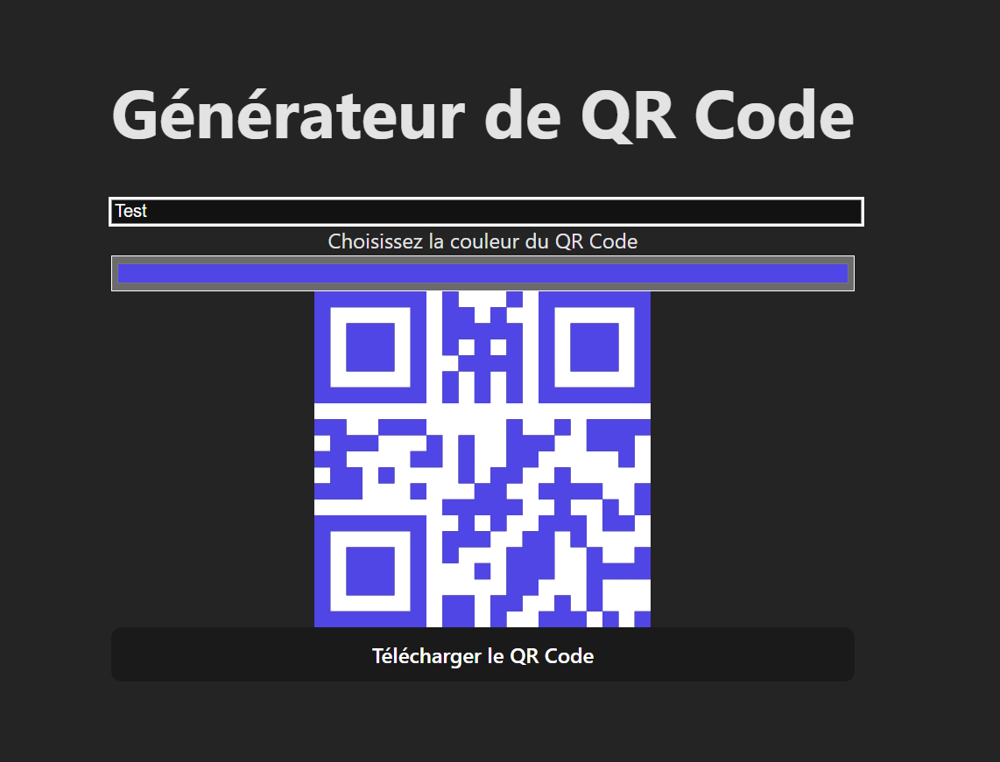

# QR Code Generator 🧾⚡

Un générateur de QR Code simple, moderne et responsive, construit avec **React** et stylisé avec **Tailwind CSS**. 🧑‍💻  
Personnalisez vos QR Codes et téléchargez-les en un clic !



## 🚀 Fonctionnalités

- ✅ Génération instantanée de QR Code à partir d’un texte ou d’une URL
- 🎨 Choix de la couleur du QR Code
- 💾 Téléchargement du QR Code au format PNG
- 📱 Design responsive (mobile-friendly)
- 🚀 Interface moderne avec Tailwind CSS

## ✨ Démo en ligne

🔗 [Voir la démo](https://qrmmi.netlify.app/)

## 📦 Installation

```bash
git clone https://github.com/Tominouu/qr-code-generator.git
cd qr-code-generator
npm install
npm run dev

